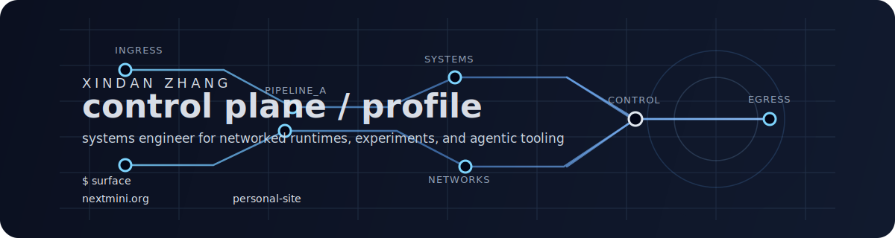

<div align="center">
  
</div>

<div align="center">

`systems` `networking` `agentic tooling`

Building networked runtimes, systems experiments, and tools for faster iteration.

</div>

```text
$ whoami
Xindan Zhang

$ focus
- networked runtimes
- systems experimentation
- agentic infrastructure
```

## Selected Projects

<table>
  <tr>
    <td width="50%" valign="top">
      <strong><a href="https://nextmini.org">nextmini.org</a></strong><br />
      Public project and primary surface.
    </td>
    <td width="50%" valign="top">
      <strong><a href="https://github.com/XindanZhang/personal-site">personal site</a></strong><br />
      Website source and personal web presence.
    </td>
  </tr>
</table>

```text
$ principles
signal over noise
focused surfaces
fewer, better artifacts
```
